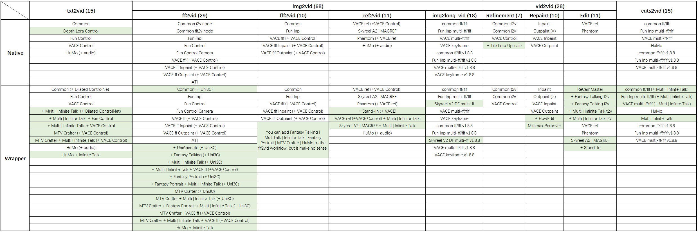
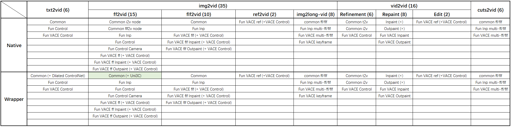

## ComfyUI Jake Upgrade

A [ComfyUI](https://github.com/comfyanonymous/ComfyUI) workflow customization by Jake.  
Feel free to join my [Discord server](https://discord.gg/2XC3w9as2f).  
If you like what I share, please support me with [PayPal](https://paypal.me/jakechaikefu).

> [!NOTE]
> - You might need ComfyUI v0.3.64 for JakeUpgrade v2.1.5up, for the `comfy_extras.nodes_compositing.SplitImageWithAlpha.split_image_with_alpha()` renaming issue.
> - [portable img2mesh ComfyUI v0.3.68 with pytorch 2.7.0+cu128](https://drive.google.com/file/d/1WTZ1Mx79VhyYmJa7un8h4lyuKWrH8yDX) includes: 3D-Pack | Hy3D 2.0 | Hy3D 2.1 | MVAdapter | IG2MV
> - [portable img2mesh ComfyUI v0.3.27 with pytorch 2.5.1+cu124](https://drive.google.com/file/d/1rUchssRRdqLQtu0A-OCkKKLU8_bd0y8q) includes: 3D-Pack | Hy3D 2.0 | MVAdapter | IG2MV
> - If you found some JK nodes missing in your workflow or in the node library, they might be set to deprecated, [here's how to enable them](https://github.com/jakechai/ComfyUI-JakeUpgrade/issues/225#issuecomment-3527504565).

## Video Introduction
- Wan Video | Wan Vace workflows: [Youtube](https://youtu.be/4KNOufzVsUs) | [Bilibili](https://www.bilibili.com/video/BV1kCJGzgEL4/)
- Wan Video update 1 (multi-GPU | Dilated CN | ATI | Uni3C preview): [Youtube](https://youtu.be/gvgX82470i0) | [Bilibili](https://www.bilibili.com/video/BV1TS7hzwE99/)
- Wan Video update 2 (Wan Eco | Long Video | Lip Sync | ref2v | MiniMax Remover and more): [Youtube](https://youtu.be/iZbT0Zi7ksg) | [Bilibili](https://www.bilibili.com/video/BV1DbaszHENZ/)
- Wan Video update 3 (long video color shift issue | i2v no-low-step-lora issue | VACE keyframe2long-vid | flf2long-vid | MTV Crafter | Real MiniMax Remover): [Youtube](https://youtu.be/CHlUq17lxN8) | [Bilibili](https://www.bilibili.com/video/BV18WHeznEiE/)
- Wan Video update 4 (Video Gen based on Scene & Audio Cuts | WAN 2.2 workflows): [showcase Wan 2.1](https://youtu.be/N__iDyJXAFU) | [showcase Wan 2.2](https://youtube.com/shorts/KEXIZLol4cg) | [Youtube](https://youtu.be/ZM8kDKj9ycw) | [Bilibili](https://www.bilibili.com/video/BV1XWWzzkERX/)
- Wan Video update 5 (Long video with camera control & pose control | Adv 3D Viewer for Video Gen): [Youtube](https://youtu.be/yO7bun8wN3o) | [Bilibili](https://www.bilibili.com/video/BV1Fu6cBqEsG/)
- Wan Video update 5.1 (use SAM3D Body to generate character motion model sequences): [Youtube](https://youtu.be/OJNodd1hYCs) | [Bilibili](https://www.bilibili.com/video/BV1JFFTziE5X/)
- img2mesh workflows: [Youtube](https://www.youtube.com/watch?v=CbG2Vq3kps0) | [Bilibili](https://www.bilibili.com/video/BV1CE4m1R7br/)
- img2mesh 3D-Pack Installation Tips：[Youtube](https://www.youtube.com/watch?v=RjuoLMCpvbI) | [Bilibili](https://www.bilibili.com/video/BV1Nm421375F/)
- img2mesh 3D-Pack Algorithm Comparison：[Youtube](https://www.youtube.com/watch?v=E7Oj8UUGLic) | [Bilibili](https://www.bilibili.com/video/BV1CU411U7y4/)
- img2mesh Hunyuan3D Wrapper workflow: [Youtube](https://youtu.be/g94Jufz9Znw) | [Bilibili](https://www.bilibili.com/video/BV1w7ZMY2Ehp/)
- img2mesh Hunyuan3D Add more MV texture samples: [Youtube](https://www.youtube.com/watch?v=hdMAksRD9jM)
- img2mesh Hunyuan3D 2.1 workflow: [Youtube](https://youtu.be/KxwdmCVB93g) | [Bilibili](https://www.bilibili.com/video/BV1sE8Rz9EGW/)
- imgen QWen Eidt Model Sheet workflow: [Youtube](https://youtu.be/SGEo8vlppG0) | [Bilibili](https://www.bilibili.com/video/BV1J3yUBLEPH/)
- imgen workflow: [Youtube](https://www.youtube.com/watch?v=PKnxhFZNu2c) | [Bilibili](https://www.bilibili.com/video/BV1h6421f7AQ/)
- imgen SD3 workflow: [Youtube](https://youtu.be/MZBNzaWHdr8) | [Bilibili](https://www.bilibili.com/video/BV1ceHheqEru/)
- imgen API workflow: [Youtube](https://www.youtube.com/watch?v=4DWWUQij9jM) | [Bilibili](https://www.bilibili.com/video/BV1QR1BYUE5r/)
- imgen 1.8.x Update(Group Nodes | Detail Daemon | Crop and Stitch | Stop At Clip Layer  | ControlNet Efficiency Mask | ControlNet Loader | "None" selection for IPAdapter Loader| Imgen workflows | API workflows | Krita workflows | Get Mesh 3D data): [Youtube](https://youtu.be/pwHsGnn0zsg) | [Bilibili](https://www.bilibili.com/video/BV1J3cuenEE2/)
- imgen Group Nodes - Image Generation and Krita workflow: [Youtube](https://youtu.be/tOy0ve2cgaQ) | [Bilibili](https://www.bilibili.com/video/BV1GXUVYRE2k/)
- imgen Prompts Switch: [Youtube](https://youtu.be/M8lVr1lP82U) | [Bilibili](https://www.bilibili.com/video/BV1ZRNwerEev/)
- imgen prompt generation workflow: [Youtube](https://youtu.be/h_2PimL3iXY) | [Bilibili](https://www.bilibili.com/video/BV1FZp4ebEjK/)
- imgen inpaint workflow: [Youtube](https://www.youtube.com/watch?v=A9nABNizMdY) | [Bilibili](https://www.bilibili.com/video/BV1wd4ge8EQf/)
- imgen Seamless Texture: [Youtube](https://youtu.be/ExPUbiRkJo0) | [Bilibili](https://www.bilibili.com/video/BV1UZ42187Gq/)

## Changelog

<b>Previous Version</b>

	
	- 2024-06-23 - v1.0.0	released.  
	- 2024-07-11 - v1.0.6	Noise Injection for Upscale Workflow.  
	- 2024-07-16 - v1.0.7	Single Image to Mesh Workflow updated.  
	- 2024-07-21 - v1.0.8	Orbit Poses Constant nodes added. 3 Image to Mesh Workflows updated.  
	- 2024-07-22 - v1.0.9	3DGS workflow added.  
	- 2024-07-24 - v1.1.0	img2mesh workflow updated. Craftsman Mesh added. 
							Three OrbitPoses nodes been added to 3D-Pack.  
	- 2024-07-31 - v1.1.1	Prompt Combine node added.  
	- 2024-08-03 - v1.1.2	Resize to Focus added to image2mesh workflow.  
	- 2024-08-21 - v1.1.3	Random Beats node added (not for AIGC).  
	- 2024-09-01 - v1.2.0	SD3 workflow added. Noise Injection (Inspire) added. 
							Refine, Upscale, and Detailer process major updated. 
							SD15 Hand Fix supports SDXL and SD3 workflow. 
							SDXL IPAdapter supports SD3 workflow. 
							NoiseInjection Component and workflow added.  
	- 2024-09-04 - v1.2.1	In/Out Paint ControlNet Component added. 
							Inpaint Module Workflow updated. 
							SD15|SDXL|SD3 Workflow updated. 
							Image Remove Alpha JK node added.  
	- 2024-09-05 - v1.2.2	Black Pixel switch added for Inpaint ControlNet Component following ControlNet Preprocessor AUX Custom Node's update.  
	- 2024-09-06 - v1.2.3	Refinement Noise Injection added. 
							txt2prompt and img2prompt workflow added. 
							img2prompt component added.  
	- 2024-09-07 - v1.2.4	img2mesh workflow doesn't need _JK.pack, so that doesn't need to install segment anything, VLM nodes, and IF AI tools.  
	- 2024-09-09 - v1.2.5	Clip l, clip g, t5xxl texture encode logic upgrade. 
							Clip l & g switch added. 
							Negative g switch added. 
							SDXL Clip Text Encode Target Resolution Scale added.  
	- 2024-09-10 - v1.2.6	detailer: add detail lora.  
	- 2024-09-11 - v1.2.7	Magic Photo Prompter added.  
	- 2024-09-13 - v1.2.8	Use Comfy UI default set union controlnet type to load xinsir sdxl controlnet union.  
							Remove Inspire Pack and WAS Nodes Suite in img2mesh workflows. 
							Group Node Image RemBG added, using InSPYReNet TransparentBG from Essentials to remove background and Image Composite Masked to add grayscale background.  
	- 2024-09-15 - v1.2.9	Inpaint Simple updated. Outpaint Simple added. 
							txt2img | img2img | inpaint workflow updated. 
							In/Out Paint to Refinement process added. 
							Upscale to Refinment process added.  
	- 2024-09-21 - v1.3.0	Inpaint/Outpaint Latent | Checkpoint | ControlNet group nodes updated. 
							Inpaint and txt2img/img2img workflows updated. 
							SD3/Flux Inpaint ControlNet added.  
	- 2024-09-24 - v1.3.1	Hand Fix Detailer upgrades, supports SD15 | SDXL | Flux. 
							SD3 Hand Fix need to choose SDXL models for the InstantX Depth ControlNet does not work properly. 
							Replace SD3 ControlNet Apply with new ControlNet Apply Node.  
	- 2024-09-25 - v1.3.2	AIO Preprocessor added for txt2img | img2img workflow.  
							Detailer, Upscale workflows updated. Refine workflow added.  
	- 2024-09-26 - v1.3.3	Latent Noise Mask switch added for Inpaint/Outpaint ControlNet. 
							Specified Dual Clip switch added for sdxl workflow.  
	- 2024-09-28 - v1.3.4	Hand Fix supports SD3 and Flux. Hand Fix module workflow added.
	- 2024-09-29 - v1.3.5	Inpaint Group Nodes upgrade, add more Image | Mask | Latent control.
	- 2024-10-01 - v1.3.6	Inpaint Group Nodes upgrade, change color grading method.
	- 2024-10-03 - v1.3.7	Remove Outpaint Pad Feathering.
	- 2024-10-06 - v1.4.0	Replace Base Ipadapter simple with IPAdapter Style and Composition Transfer in SD15 and SDXL workflow.
							SD3 Aspect Ratio node and SD3 Base Model Parameter node added. 
							SD3 Api workflow added to make up the shorcomings of SD3 local deployment using Stability SD3 control and inpaint nodes.
	- 2024-10-10 - v1.5.0	Flux KSampler and Flux Ksampler Adv group nodes added.
							Flux txt2img and img2img workflow added. Flux KSampler workflow added.
							Inpaint/Outpaint ControlNet and Checkpoint method order changed.
							Enchance and Resize Input Image added for img2img workflow.
							Noise | Guider | Sampler | Sigmas switch added.
	- 2024-10-10 - v1.5.1	Fal LLM and VLM API added for prompt generation workflow and SAI API workfkow.
	- 2024-10-11 - v1.5.2	Flux KSampler Adv updated, use SplitSigmas instead of SplitSigmasDenoise.
	- 2024-10-19 - v1.6.0	Image Generation group node and module workflow added.
							Switch Model and CLIP JK🐉 node removed.
							Rename Apply ControlNet Stack SD3 to Applly ControlNet VAE.
							Tiling Mode and Empty Latent Color nodes added.
	- 2024-11-08 - v1.7.0	Normal | Input version of Image Gen and Image Gen Adv group nodes added.
							Krita workflow added using Input version of Image Gen group nodes.
							Remove Comfyroll Custom Nodes from the must-have-node list.
							ControlNet Apply and ControlNet Stack nodes upgraded, supports Union, Alimama Inpaint.
							ControlNet Stack Input Switch node added.
							Add Blend with Original Mask option to Inpaint, Image Gen Adv and Image Gen Input group nodes.
							IsMaskEmpty Node and Image Crop by Mask Group Node added.
	- 2024-12-24 - v1.8.0	1. Add SAI API Replace Background and Relight. Add missing parameters of SAI API nodes.
							2. Add Detail Daemon Custom Nodes to most of image|mesh generation workflows and group nodes.
							3. Add SDXL Target Res JK🐉 node to fix SDXL Text Encode Target Resolution not working.
							4. Add Image | Latent Crop by Mask, Resize, Crop by Mask and Resize, Stitch nodes. Add Crop and Stitch operation for Image Gen and Inpaint Group Nodes.
							5. Update img2mesh MV upscale method to achieve better results: SD15 img2img + SDXL Refine + Ultimate Upscale.
							6. Add Bool_Or and Bool_And nodes for workflows need to be group. Replace Bool Binary Operation node (Or as default) with Bool_Or.
							7. Add Color Grading Node.
							8. Seperate Multi-ControlNet Stack node to ControlNet Loader and Multi-ControlNet Param Stack.
							9. Add "None" selection as default to IPAdapter Unified Loader for better workflow control, especially in API mode.
							10. Add Image Refine Group Node.
							11. Krita image generation workflows updated.
							12. Add Krita Refine, Upscale and Refine, Hand fix, CN preprocessor, remove bg and SAI API module series.
							13. Remove JK🐉::Pad Image for Outpainting. Remove JK🐉::CLIPSegMask group node, replace it with Essentials CLIPSeg node.
							14. Remove [WAS Node Suite](https://github.com/WASasquatch/was-node-suite-comfyui) and [Layer Style](https://github.com/chflame163/ComfyUI_LayerStyle) Custom Node from must-have-list for their complexity.
							15. Remove useless Group Nodes: JK🐉::Image to Prompt (LLava Local), JK🐉::Image to Prompt Advanced (LLava Local), JK🐉::SegAnythingMask, JK🐉::txt2img.
							16. SD3 | Flux image generation workflow | group nodes support Stop At Clip Layer (needs ComfyUI v0.3.8up).
	- 2024-12-27 - v1.8.5	1. Add new Detailer Module.
							2. Add new image generation workflow.
							3. Fix Krita HandFix workflow bug.
	- 2025-01-03 - v1.8.6	1. ControlNet image supports alpha. Add A1111-ControlNet-like effective mask for ControlNet (Stack) Apply nodes.
							2. Load Image With Alpha, Make Image Grid, and Split Image Grid nodes added.
							3. IF AI nodes recreated.
							4. ComfyUI API workflow added.
							5. Get Mesh 3D data workflow added.
	- 2025-01-10 - v1.8.8	1. Add ControlNet Effective Mask switch for all Image Generation Group Nodes.
							2. Fix image resolution bug of Image Generation adv group nodes.
							3. First Comfy Org Registry version.
	- 2025-02-04 - v1.9.0	1. Add Inject Latent Noise to advanced imgen group nodes.
							2. Fix the Input Mask logic of advanced imgen group nodes.
							3. Add "SD3 Prompts switch" for SD3 imgen group nodes.
							4. Switch clip l and g bug fix.
							5. Follow the update of Inspire-Pack Random Noise node for imgen group nodes.
							6. Image Generation | API | Kirta workflows updated.
	- 2025-02-08 - v1.9.1	1. Add Stop At Clip Layer to image refine group nodes.
							2. Add Flux Guidance to common imgen | refine group nodes.
							3. Add ComfyUI API workflows: controlnet preprocessor | upscale | refine.
	- 2025-02-17 - v1.9.2	1. Update JK_module_Mesh-Get_3D_data module workflow.
							2. Imgen SDXL API workflow bug fixed.
							3. Add checkpoint version flux API workflows.
							4. Add image grid API workflows.
	- 2025-02-20 - v1.9.3	1. Update IPAdapter nodes along with the Main branch.
							2. Add Discord server.
	- 2025-02-24 - v1.9.4	1. Update Mesh-Get 3D data workflow along with the Load 3D node.
							2. Update auto-prompt workflows along with the Flux Prompt Generater node.
	- 2025-02-27 - v1.9.5	1. Add new parameters to SAI API nodes.
							2. All SAI API nodes have been approved by [ComfyUI SAI API](https://github.com/Stability-AI/ComfyUI-SAI_API) and been removed from replacement folder..
							3. Update IPAdapter nodes along with the Main branch.
	- 2025-03-13 - v1.9.6	1. Save MVs/CCMs/Depths/Images in both png and exr for img2mesh workflows. Add Load png|exr switch.
							2. Add Get OrbitPoses From List JK🐉 node. Replace Get CamPoses From List node of 3D Pack.
							3. Fix HandFix workflow issue.
							4. Update Get Mesh 3D Data workflow using the new Load 3D Node.
	- 2025-03-22 - v1.9.7	1. CR TriMesh Input Switch JK🐉 added for Hunyuan 3D Wrapper workflow.
							2. Add Hunyuan 3D Wrapper img2mesh workflow.
							3. Updage MV upscale and refine process for img2mesh workflow.
	- 2025-04-05 - v1.9.8	1. Cleaning up the codes.
							2. UI for ComfyUI API released.
							3. Update Seamless Texture workflow.
	- 2025-05-09 - v1.9.9	1. Add Florence 2 to Auto Prompt Workflow.
							2. Add Segment Anything 2 to Detailer Workflow.
							3. Add Flux Fill to Flux imgen group node and workflow.
							4. Add RoughOutline_JK node to generate motion outline.
							5. Add OpenDWPose_JK node to combine openpose and dwpose.
							6. Add Wan Video main workflow and module workflows.
	- 2025-05-11 - v1.9.10	1. Update Wan Video repaint workflows.
	- 2025-05-12 - v1.9.11	1. Add Wan Video VACE ff/flf2vid repaint workflows.
	- 2025-05-12 - v1.9.12	1. Update Wan Video VACE workflow.
	- 2025-05-18 - v1.9.13	1. Update Wan Video VACE workflow.
	- 2025-05-20 - v1.9.14	1. Add Trim Video Latent Node ot Native Wan VACE workflow. Update Native t2v and r2v Wan VACE workflow.
							2. Remove Save Image and Save Webm nodes for Auto Mask | Auto Motion | Control Video Module workflow. Video Combine can save as both.
	- 2025-05-29 - v1.9.15	1. Use 10 camera for Hy3D MV Sampling by default.
							2. Add Mesh MV sample generation module workflow using IG2MV, MV Adapter and Stable X Delight.
							3. Add Multi-GPU version of Wan Video Generation workflows.
							4. Add the Wan Vace 14B fp16 model to the model list instruction.
	- 2025-06-02 - v1.9.16	1. Add Dilated ControlNet for Wan Video t2v workflows.
							2. Add Canny & HED Control Video generation methods for Dilated ControlNet.
							3. Add Save|Load StringListToJSON nodes to save|load ATI Trajectory presets.
							4. Add ATI Trajectory generation method to Video-Auto Motion module.
							5. Add Wan Video ATI Trajectory ff2vid workflow.
							6. Use bf16 Wan Video VAE by default for all Wan Video generation workflows.
							7. Add Multi-GPU version of Flux Image Generation workflow.
	- 2025-06-15 - v1.9.17	1. Find a workaround to recreate all of my original Group Nodes for `comfyui-frontend-package>=1.16.0`. [All Grp Nodes-JK](Workflow/ComfyUI/All%20Grp%20Nodes-JK.json) | [All Grp Nodes-JK_~frontend-1.15.13](Workflow/ComfyUI_~frontend-1.15.13/All%20Grp%20Nodes-JK.json)
							2. Seperate all workflows into two versions: `comfyui-frontend-package<=1.15.13` & `comfyui-frontend-package>=1.16.0`. Workflows for `comfyui-frontend-package<=1.15.13` are moved to the subfolder with a suffix name `~frontend-1.15.13`, such as `ComfyUI_~frontend-1.15.13` and `Krita_~frontend-1.15.13_v1.19.16`.
							3. API workflows are separated into two versions: one for `ComfyUI-JakeUpgrade v1.9.16 or earlier`, the other for `ComfyUI-JakeUpgrade v1.9.17 or later`. API Workflows for `ComfyUI-JakeUpgrade v1.9.16 or earlier` are moved to the subfolder with a suffix name `~v1.9.16`, such as `ComfyUI_~frontend-1.15.13\API_~v1.9.16` and `Krita_~frontend-1.15.13_v1.19.16`.
							4. Cleanup and rearrange the codes, and press Deprecated and Experimental to distinguish.
							5. Remove java script.
							6. Re-write Lora | ControlNet | Embedding nodes without java script control.
	- 2025-06-16 - v1.9.18	1. Fix Krita Upscale and Refine workflows.
	- 2025-06-16 - v1.9.19	1. Update Wan Video workflows using v1.6.0 Group Nodes.
	- 2025-07-30 - v1.9.20	1. Integrate Hunyuan3D 2.1 Mesh Reconstruction + De-lighted MVs Generation + PBR Texture Baking features to img2mesh workflow.
							2. Add "Hy3D Cam Config 20to21 JK🐉" node.
	- 2025-08-14 - v2.0.0	1. Create Subgraphs based on my Group Nodes and recreate all workflows using Subgraph.
							2. Move all latest workflows using Group Node to subfolder named `ComfyUI_~frontend-1.23.4` or `Krita_~frontend-1.23.4_v1.19.20`.
							3. Add LoRA Stack Model Only JK🐉, Apply LoRA Stack Model Only JK🐉.
							4. Add Set LoRA | NAG | Set Radial Attention | FreeInit features to all WAN video gen workflows.
							5. Add native VACE ff2v | VACE flf2v | VACE v2v | ATI ff2v | Fun control camera ff2v | Skyreel A2 ref2v | Phantom ref2v workflows.
							6. Add native and wrapper Wan MAGREF workflows.
							7. Update ref2v (subject2v) Wan workflows.
							8. Add MultiTalk ff2v and v2v Wan Wrapper workflows.
							9. Add Multitalk | Fantasy Talking v2v lip sync Wan Wrapper workflows.
							10. Add Uni3C Camera Control to ff2v Wan Wrapper workflows.
							11. Add MiniMax Remover v2v Wan Wrapper workflow.
							12. Add Stand-In ref2v Wan wrapper workflows.
							13. Add VACE | Phantom | Stand-In ref+v2v Face Swap workflows.
							14. Add Create Loop Schedule List JK🐉 node.
							15. Update SkyreelV2 DF long video Wan Wrapper workflow.
							16. Add VACE long video Wan workflow.
							17. Use the Torch Compile Model Wan Video v2 node for Native Wan Video workflows.
							18. Set minimum resolution of Crop by Mask to 64.
							19. Refine Common Group Node issue fixed.
							20. Add Ksampler Adv Parameters Default JK🐉 node and 🐉 JK:::KSampler (High+Low) Group Node for Wan2.2.
							21. Fix Switch(Any) node output datatype error in all workflows.
							22. Update Refine Common Group Node for all workflows (ComfyUI frontend 1.23.4 or earlier).
	- 2025-08-21 - v2.0.1	1. Add conditioning combine and Vace to Video nodes for Wan Phatom workflows.
							2. Load String List From JSON JK🐉 node support both string list and JSON object.
							3. Add Wan Wrapper Multitalk + Vace workflow.
							4. Share Multitalk and Infinite talk workflows.
							5. Add Wan t2v Fantasy Talking | Multitalk | Infinite talk workflows.
							6. Add Wan wrapper ff2v Fantasy Portrait (+ Multitalk | Infinite talk) workflow.
	- 2025-08-21 - v2.0.2	1. Add FUN Inp long video Wan workflow.
							2. Fix Vace long video Wan workflows.
	- 2025-08-24 - v2.0.3	1. Add ff2v VACE long video solution using Context Options.
							2. Add v2v refinment using i2v main model.
							3. Add v2v lip sync using i2v main model.
							4. Add v2v face swap using Skyreel A2 | MAGREF.
	- 2025-09-02 - v2.0.4	1. Update ff2v VACE long video solution using Context Options, named VACE keyframe2v.
							2. Update VACE workflow.
	- 2025-09-03 - v2.0.5	1. Fix error issue in all the latest workflows using Subgraph: KJ Get node | rgthree Seed node will cause an error if it is in bypass state and is linked to a Subgraph.
							2. Add Wan t2v MTVCrafter workflow. Add Wan ff2v MTVCrafter (+Uni3C) workflow.
	- 2025-09-04 - v2.0.6	1. Fix Wan Model Loader vace model slot renaming issue in all the latest workflows using Subgraph.
							2. Add Wan t2v MTVCrafter + multitalk | infinite talk workflow. Add Wan ff2v MTVCrafter (+ fantasy portrait) + multitalk | infinite talk workflow.
							3. Add Wan VACE keyframe2v long video gen workflow.
	- 2025-09-05 - v2.0.7	1. Add Wan ff2v long video gen workflow.
							2. Add a "Color Match" node to all long video generation workflows (except VACE keyframe2long-vid) as a temporary method to maintain color consistency.
	- 2025-09-08 - v2.0.8	1. Add v1.1.8 long video generation workflows for Wan Video Wrapper v1.1.8 to achieve better color consistency.
	- 2025-09-09 - v2.0.9	1. Add flf2v method to ff | FUN | VACE long video generation workflows.
	- 2025-09-11 - v2.0.10	1. Update Auto Motion Module workflow. Both VACE and ATI support multiple trajectories in one Spline Editor.
	- 2025-09-12 - v2.0.11	1. Update WanVideo ImageToVideo Encode Node.
							2. Update Wan Eco Information.
	- 2025-09-16 - v2.0.12	1. Add QWen imgen subgraphs and workflows.
							2. Reduce and retain commonly used auto-prompt custom nodes.
							3. Remove Prompt Stylers preset files.
	- 2025-09-17 - v2.0.13	1. Add Flux Kontext | USO | USO Style | Redux | Redux Style subgraphs.
							2. Update QWen | Flux imgen workflows.
							3. Add image edit module workflow.
	- 2025-09-17 - v2.0.14	1. Add Hunyuan Prompt Enhancer to imgen workflows.
	- 2025-09-18 - v2.0.15	1. Add Imgen Qwen | Imgedit Qwen | Imgedit Flux Kontext | Imgedit Flux Redux | Imgedit Flux USO API and Krita workflows.
	- 2025-09-27 - v2.0.16	1. Add HuMo t2v | ref2v + s2v | infinitetalk workflows.
							2. Add a description about the fp8_e5m2 model, which is available for Triton.
							3. Add Audio Cuts JK🐉 | Cut Audio JK🐉 | Cut Audio Index JK🐉 | Cut Audio Cuts JK🐉 | Cut Audio Loop JK🐉 | Get Nth String JK🐉 | Wan Frame Count JK🐉 nodes.
							4. Add first two of Wan Video "Cuts" series workflows (VACE | Talk), supports multiple video generation based on scene and audio cuts.
	- 2025-10-02 - v2.0.17	1. Add Native Wan HuMo workflows.
							2. Add Wan Video "Cuts" series workflows (ff | fun | HuMo), supports multiple video generation based on scene and audio cuts. [showcase](https://youtu.be/N__iDyJXAFU)
	- 2025-10-10 - v2.1.0	1. Add Wan22 cfg Scheduler List JK🐉 node.
							2. Add 🐉 JK:::KSampler (High+Low) Adv | 🐉 JK:::WAN Sampler (High+Low) | 🐉 JK:::WAN Sampler (High+Low) adv subgraphs.
							3. Add Wan Frame Count JK🐉 nodes to most of the Wan Video workflows.
							4. Add Wan2.2 video generation workflows.
							5. Add Wan2.1 native v2v workflow using i2v model.
							6. Rename Subgraphs prefix from `JK🐉:::` to `JK🐉-` for all workflows.
							7. Add JakeUpgrade Subgraph JSON files.
	- 2025-10-10 - v2.1.1	1. Update cuts_talk workflow, supports v2v lipsync.
	- 2025-10-12 - v2.1.2	1. Add QWen Edit 2509 and QWen Edit 2509 RAW subgraphs.
							2. Update QWen Image Gen | Edit workflows.
							3. Add IntSubOp node.
	- 2025-10-12 - v2.1.3	1. Add Wan Wrapper Sampler Default node.
							2. Add 🐉 JK:::KSampler (High+Low) | 🐉 JK:::KSampler (High+Low) Adv Group Nodes for frontend v1.23.4.
	- 2025-10-13 - v2.1.4	1. Recreate missing Group Nodes for Runninghub based on Subgraphs.
	- 2025-10-13 - v2.1.5	1. Fix `comfy_extras.nodes_compositing.SplitImageWithAlpha.split_image_with_alpha()` naming issue. Rename it to `comfy_extras.nodes_compositing.SplitImageWithAlpha.excute()`.
	- 2025-10-15 - v2.1.6	1. Update Hunyuan3D img2mesh workflow: ① supports 4K even 8K texture generation; ② Resize the input image to a valid resolution.
							2. Create Hunyuan3D2.1 one-click version img2mesh workflow for runninghub.
							3. Deprecate Hy3D Cam Config 20to21 JK🐉 node.
							4. Fixed INT and Float min | max value for Math nodes.
	- 2025-10-15 - v2.1.7	1. Fix Loop Frame count calculation bug in SceneCuts Node.
	- 2025-10-16 - v2.1.8	1. Disable min_loop_frame_count parameter in SceneCuts Node.
	- 2025-10-16 - v2.1.9	1. Add Qwen resolution to resolution select list.
							2. Add Random Prompter JK🐉 node. Replace Flux Prompt Generater with Random Prompter JK🐉.
							3. Add JK🐉-Image Edit QWen 2509 Adv subgraph.
							4. Delete SD3 imgen multigpu version workflow for no triple clip loader multi gpu node any more.
	- 2025-10-27 - v2.2.0	1. Re-write all nodes:  
							① Code Organization: Nodes are logically grouped by data type and functionality.  
							② Modular nodes loading control, including deprecated nodes.  
							③ Comments: All key functions and classes have detailed.  
							④ Documentation: Each node class has an description and tooltip.  
							⑤ Type Hints: Type hints have been added to all functions.  
							⑥ Naming Conventions: Naming conventions for return values ​​have been standardized.  
							⑦ Error Handling: Necessary imports and error handling have been added.  
							2. Add Random Prompter JK🐉 node, deprecate Flux Prompt Generator.
							3. Add QWen_ModelSheet and QWen_ModelSheet adv imgen/imgedit workflow.
							4. Add Portrait Master + Random Prompter imgen workflow.
	- 2025-10-28 - v2.2.1	1. Update model sheet workflow.
							2. Add Hunyuan Prompt Enhancer and fal LLM nodes to portrait master + random prompter workflow.
							3. Add EXCLUSION_MARK parameter in the Random Prompter to exclude files in random mode.
							4. Add more choices for to Random Prompter data.
	- 2025-10-28 - v2.2.2	1. Random Prompter bug fixed.
							2. Fix bad connections in portrait master + random prompter workflow.
	- 2025-10-30 - v2.2.3	1. Fix Make Image Grid `from torchvision import transforms as TF` -> `import torchvision.transforms.functional as TF` issue.
							2. Upgrade Split Image Grid node:  
							① Reasonable default values: Ensure at least 1 row/column to avoid division by zero errors.  
							② Better error messages: Provide specific resolution suggestions.  
							③ Boundary checks: Ensure cropping does not exceed the image area.  
							④ Empty list protection: Ensure a valid image tensor is always returned.  
							⑤ Exception handling: Gracefully handle errors in crop mode.  
							3. Separated the `install.py` file for ComfyUI and the `install_manual.py` file for the `install.bat` file.
							4. Zip IPAdapterPlus.py to IPAdapterPlus.zip to avoid node-conflict attention in ComfyUI Manager.
							5. Random Prompter supports both string dictionaries, lists or txt format for YAML files.
							6. Add more choices to Random Prompter.
	- 2025-11-07 - v2.3.0	1. Add Random Prompter Geek Node, more convenient random control.
							2. Add ABC and non-ABC version of Random Prompter Nodes switch to config.ini.
							3. Add Random Prompter config to config.ini.
							4. Add more choices for Random Prompter Nodes with more refined and accurate categories.
	- 2025-11-07 - v2.3.1	1. Add Nodes description.
	- 2025-11-08 - v2.3.2	1. Move SDXL Target res node back to misc from deprecated.
							2. Add more choice for Random Prompter.
	- 2025-11-10 - v2.3.3	1. Fix path separator mismatch issue of Random Prompter in Linux.
							2. Add more choices for Random Prompter.
	- 2025-11-10 - v2.3.4	1. Add System Prompter node for generating single image | shot script system prompt for LLM/VLM model. Supports JSON format and multi-language output request. QWen3-VL is recommended.
							2. Add Shot Script Extractor and Combiner nodes.
							3. Add QWen3-VL to auto-prompt workflows along with System Prompter node.
	- 2025-11-12 - v2.3.5	1. Update Shot Script Extractor and Combiner nodes.
							2. Update Prompt Combiner node.
							3. Add portable img2mesh ComfyUI `v0.3.68` with `pytorch 2.7.0+cu128`.
							4. Add shot size and view angle choices for Random Prompter, useful when using QWen Edit 2509 Multiple Angles Lora.
	- 2025-11-14 - v2.3.6	1. Random Prompter Geek supports the custom selection of database random processing and reserved LLM processing, retaining the advantages of database random processing in certain aspects of semantic accuracy while leveraging the possibilities that LLM can provide in other elements.
							2. Fix some typo issues.
	- 2025-11-15 - v2.3.7	1. Add remove_prompt_emphasis function to Random Prompter and Prompt Combiner.
							2. Update Portrait Master + Random Prompter imgen workflow.
	- 2025-11-17 - v2.3.8	1. Update Shot Script Extractor node, supports extracting specific element from string list, dictionary stirng, array string or multiline string based on index or key value.
	- 2025-11-17 - v2.3.9	1. Update prompt nodes codes. Separate into jake_node_prompt_shared | jake_node_prompt | jake_node_prompt_random | jake_node_prompt_random_ABC.
	- 2025-11-19 - v2.3.10	1. Add Wan 2.1 lynx ref2v sub-workflow.
							2. Add Wan 2.1 MoCha v2v subject replacement sub-workflow.
							3. Add Wan 2.1 FlashVSR video upscale sub-workflow.
							4. Add Wan 2.1 UniLumos v2v relight sub-workflow.
							5. Add Wan 2.1 LongCat long video gen sub-workflow.
							6. Add Wan 2.2 Time-to-Move ff2v sub-workflow.
							7. Add Wan 2.2 5B Ovi txt2v and ff2v sub-workflow.
							8. Add Wan 2.2 5B Lucy Edit v2v sub-workflow.
	- 2025-11-22 - v2.3.11	1. Remove `funtools` from project.toml.
							2. update Wan Video Sheduler list.
	- 2025-11-23 - v2.3.12	1. Add SAM3 to imgen detailer and videogen auto mask workflows.
							2. Add 🐉 JK-Tools-AddAllMasks subgraph.
	- 2025-11-25 - v2.3.13	1. Add Wan 2.2 FFGO ref2v sub workflows.
							2. Add Stable-Video-Infinity lora supports to Wan 2.1 long | Cuts ff2v sub workflows.
							3. Add Wan 2.1 Ditto video edit sub workflows.
							4. Add Wan 2.1 longcat refiner v2v sub workflows.
	- 2025-11-30 - v2.3.14	1. Fix Get node error caused by the latest ComfyUI in the QWen Model Sheet workflow.
	- 2025-12-27 - v2.4.0	1. Add Advanced 3D Viewer Node, supports GLB, FBX, SMPL bin, OBJ, and PLY formats with/without animation, and with custom camera animation and exported as GLB.
	- 2026-01-07 - v2.4.1	1. Add adv3d_viewer_jk features:  
								① wireframe, Normal, Depth, lineart, canny, edge, contour, ssao, and gtao shading support.  
								② shading and default light gui support.  
								③ center to object and focus to object function  
							2. Update img2mesh 3D Data workflow.
	- 2026-01-15 - v2.4.2	1. Add adv3d_viewer_jk features:  
								① Reduce GPU usage: Control FPS, control RAF(requestAnimationFrame), control postProcessing.  
								② More detailed Scene Diagnostics.  
								③ Support zip format: obj.zip (obj + (mtl) + textures) | fbx.zip (fbx + textues) | glb(gltf).zip (glb(gltf) + bin + textures).  
								④ Fix bug: recording never stop; GTAO GUI broken.  
								⑤ Add screenshot btn.  
								⑥ Add Loading UI.
	- 2026-01-15 - v2.4.3	1. Add adv3d_viewer_jk features: Generate 3D Data.   
	- 2026-01-18 - v2.4.4	1. Add adv3d_viewer_jk features:  
								① Mesh select.  
								② Original material | multi-sub material Editor for selected mesh.  
								③ Center | focus to selected mesh.  
								④ Get 3D Data for selected mesh.  
	- 2026-01-19 - v2.4.5	1. Fix adv3d_viewer_jk bugs: disablePostProcessing includes renderPass; original material gui keep showing when switch to other material modes.  
	- 2026-01-19 - v2.4.6	1. Fix adv3d_viewer_jk bugs: choose the shortest path around the rotation angle.  
	- 2026-01-20 - v2.4.7	1. Fix adv3d_viewer_jk bugs: select invisible meshes.  
							2. Add adv3d_viewer_jk features: Add random env for camera tracking.  
	- 2026-01-25 - v2.5.0	1. Add Pose Control workflows for WAN Animate | OTA | Steady Dance | SCAIL.
							2. Add | Update Wan (long) video generation with pose control workflows including Vace, Wan Animate, SCAIL, One to All, Steady Dance.
							3. Replace all Enchance And Resize Hint Images JK nodes in video gen workflows with KJ Resize v2 node.
							4. Since KJ make Uni3C suport t2v model, which is great, I add Uni3C to VACE and t2v workflows.
							5. Change default attention to sage attention instead of radial attention.  
							6. Clip Loader Multi GPU node doesn't work for the latest ComfyUI, it looks like the generation never follows the prompts, especially for t2v. Replace it with the CLIPLoaderDisTorch2MultiGPU node.
	- 2026-01-27 - v2.5.1	1. Provide the modified `SeamlessTile.py` for seamless-tiling workflow since [Seamless tiling](https://github.com/spinagon/ComfyUI-seamless-tiling) does not work with the latest ComfyUI and is inactive.
	- 2026-01-29 - v2.5.2	1. SCAIL workflows update.
							2. Control Video Gen workflow update.
							3. Add more random boxes to the background for Adv 3D Viewer node.
	- 2026-01-31 - v2.5.3	1. Add SAM3D Mesh Sequence From Video node to get mesh sequence from video using SAM3D. Need to install [ComfyUI-SAM3DBody](https://github.com/PozzettiAndrea/ComfyUI-SAM3DBody).
	- 2026-02-01 - v2.5.4	1. Update SAM3D Mesh Sequence From Video node: Align the mesh sequence to the video instead of aligning along the creation center.
	- 2026-02-02 - v2.5.5	1. Update SAM3D Mesh Sequence From Video node: set z offset to 0 for mesh sequence.

- 2026-02-04 - v2.5.6
1. Add Wan 2.2 SVI pro long video generation workflow.

- 2026-02-05 - v2.5.7
1. Add JK_module_Motion-Get_Mesh_Sequence workflow [here](Workflow/ComfyUI/Module/JK_module_Motion-Get_Mesh_Sequence.json).

- 2026-02-12 - v2.5.9
1. Add Trellis 2 img2mesh workflow but the result is not as good as the official space.
2. Update auto prompt workflows using new QWen3 Prompt Enhancer node.
3. Add LTXV2 video generation workflow, supports t2v | ff2v | lf2v | flf2v | frames2v | v2v, supports ControlNet | upscale.
4. Add more camera motion to Random Prompter.
5. Change SeamlessTile to "Modify in place" for all SD15 | SDXL workflows | Group Nodes | Subgraphs.

- 2026-02-14 - v2.6.0
1. Update the JK_module_Imgen_Seamless Texture workflow and remove deprecated nodes.
2. Update the JK_workflow_imgen_RandomPrompter workflow and using the latest Portrait Master nodes.

- 2026-02-15 - v2.6.1
1. Update System Prompter node, supports shot scripts for video generation.
2. Update workflows including System Prompter node.

- 2026-02-15 - v2.6.2
1. Update camera angle for Random Prompter, supports Qwen-Image-Edit-2511-Multiple-Angles-LoRA.

- 2026-02-17 - v2.6.3
1. Add audio selections to Random Prompter.
2. Update workflows with Random Prompter.
3. Add Trellis multiview mesh generation workflow and replace remesh node with remesh with Quad node.
4. Add LTXV2 video extend sub workflow to it's main workflow.
5. Update CutAudio_JK node, generate silent audio if no audio input.

## Installation
1. `git clone https://github.com/jakechai/ComfyUI-JakeUpgrade` into the `custom_nodes` folder 
    - e.g. `custom_nodes\ComfyUI-JakeUpgrade`
	
	OR: Install using ComfyUI Manager.
2. Open a Command Prompt/Terminal/etc.
3. Change to the `custom_nodes\ComfyUI-JakeUpgrade` folder you just created 
    - e.g. `cd C:\ComfyUI_windows_portable\ComfyUI\custom_nodes\ComfyUI-JakeUpgrade`
4.  Install python packages
      - **Windows Standalone installation** (embedded python):  
		run install.bat  
        Manual: `../../../python_embeded/python.exe -s -m pip install -r requirements.txt`  
      - **non-Windows installation**:  
        Manual: `pip install -r requirements.txt`  

## Copy files in the replacement folder(optional)

- [JakeUpgrade Subgraphs](replacement/subgraphs): Copy all the subgraph JSON files into `...\ComfyUI\user\default\subgraphs`.
- [ComfyUI Manager](https://github.com/ltdrdata/ComfyUI-Manager) : Copy `_JK.pack` or  `__JK_1_15_13.pack`(for `comfyui-frontend-package<=1.15.13`) to `...\ComfyUI\user\default\ComfyUI-Manager\components` for saving all JK Group Nodes within each workflow file.
- [IP Adapter Plus](https://github.com/cubiq/ComfyUI_IPAdapter_plus) : (Workaround before IPAdapter approves my pull request) Copy and replace files to `custom_nodes\ComfyUI_IPAdapter_plus` for better API workflow control by adding "None" selection.

> [!NOTE]
> - Subraphs can be used as custom nodes if you copy the JSON files to the `...\ComfyUI\user\default\subgraphs`.
> - Subraphs | Group Nodes can be copied and pasted between workflows in the ComfyUI. See details in my Video Introduction of Subraphs | Group Nodes.
> - For all JK Subraphs | Group Nodes, load [All Subgraphs-JK](Workflow/ComfyUI/All%20Subgraph-JK.json) | [All Subgraphs-WanVideoWrapper-JK](Workflow/ComfyUI/All%20Subgraph-Wan-JK.json) | [All Grp Nodes-JK_~frontend-1.23.4](Workflow/ComfyUI_~frontend-1.23.4/All%20Grp%20Nodes-JK.json) | [All Grp Nodes-WanVideoWrapper-JK_~frontend-1.23.4](Workflow/ComfyUI_~frontend-1.23.4/All%20Grp%20Nodes-Wan-JK.json) | [All Grp Nodes-JK_~frontend-1.15.13](Workflow/ComfyUI_~frontend-1.15.13/All%20Grp%20Nodes-JK.json)
> - These replacement files cause the node conflict warning in the ComfyUI Manager. But don't worry, JakeUpgrade never loaded them.

## Update
1. ComfyUI Manager - Fetch Update - Search JakeUpgrade and Update.
2. ComfyUI Manager - Custom Nodes Manager - Search JaKeUpgrade and Try Update (If method 1 fails).
3. Change to `custom_nodes\ComfyUI-JakeUpgrade` folder, open cmd or PowerShell, type `git pull`  (If method 1 & 2 fails).

> [!NOTE]
> - Files in the replacement folder need to be updated by hand if needed.

## JakeUpgrade Nodes

<b>Custom Nodes</b>

- 3D Nodes  
  
  
  
  
  
  
Adv3DViewer JK🐉: Supports GLB, FBX, SMPL bin, OBJ, and PLY formats with/without animation, and with custom camera animation and exported as GLB.  
  
SAM3D Mesh Sequence JK🐉: Get mesh sequence from video using SAM3D.  
 
Orbit Poses JK🐉: Generate 3D camera track pose configurations, supporting multiple preset and custom parameters.  
  
Orbit Lists to Orbit Poses JK🐉: Convert track list format to camera pose format.  
  
Orbit Poses to Orbit Lists JK🐉: Convert camera pose format to track list format.  
  
Get Orbit Poses From List JK🐉: Select a specific pose by index from a list of camera poses.  
- Audio Nodes  
  
Scene Cuts JK🐉: Create scene cuts based on multiple cut point times or durations and an optional audio duration.  
  
Cut Audio JK🐉: Cut an audio file based on start and end time.  
  
Cut Audio Index JK🐉: Cut an audio file based on scene cuts metadata and cut index.  
  
Cut Audio Cuts JK🐉: Merge all cuts from scene_cuts into a single audio file in chronological order.  
  
Cut Audio Loop JK🐉: Cut an audio file based on loop metadata and cut index.  
- Video Nodes  
  
Create Loop Schedule List JK🐉: Generate a sequential integer list for animation loop scheduling.  
  
Wan Frame Count JK🐉: Calculate WAN-compatible frame count by rounding up to nearest multiple of 4 plus 1.  
  
Wan22 cfg Scheduler List JK🐉: Generate CFG scheduler list with initial and subsequent values for WAN 2.2.  
  
Wan Wrapper Sampler Default JK🐉: Provide default sampler settings for WAN wrapper including scheduler and rope function.  
- Prompt Nodes  
  
Random Prompter JK🐉: Random prompt generator with categorized options for scene, motion, facial actions, expressions, lighting, camera, style, and description. Supports manual selection, random generation, and image reference integration for comprehensive prompt creation.  
  
Random Prompter Geek JK🐉: Random Prompter Geek version: Build prompts using category tags that are replaced with random content at runtime. Supports manual category selection and automatic tag insertion.  
  
System Prompter JK🐉: Build single image | shot script system prompt for LLM/VLM based on preset templates and user configuration. Supports JSON format and multi-language output request. QWen3-VL is recommended.  
  
Shot Script Combiner JK🐉: Combine shot scripts into string list output.  
  
Shot Script Extractor JK🐉: Extract specific element from string list, dictionary stirng, array string or multiline string based on index or key value.  
  
Prompt Combine JK🐉: Merge the two strings into one and clean up the result.  
  
Prompt node exsample 01: In conjunction with QWen VL, input different system prompts from the System Prompter node to generate a single image or shot script list, supporting JSON format output. The workflow is embedded in the image.  
  
Prompt node exsample 02: Random Prompter Geek supports the custom selection of database random processing and reserved LLM processing, retaining the advantages of database random processing in certain aspects of semantic accuracy while leveraging the possibilities that LLM can provide in other elements. The workflow is embedded in the image.  
- ControlNet Nodes  
  
ControlNet Loader JK🐉: Load ControlNet models with configurable union types.  
  
Multi-ControlNet Param Stack JK🐉: Stack multiple ControlNet parameters for complex control scenarios.  
  
Apply ControlNet JK🐉: Apply single ControlNet to conditioning with mask support.  
  
Apply Multi-ControlNet Adv JK🐉: Apply multiple ControlNets from stack to conditioning.  
- LoRA Nodes  
  
LoRA Stack JK🐉: Stack multiple LoRA models with prompt and metadata generation.  
  
Apply LoRA Stack JK🐉: Apply multiple LoRA models from stack to both model and CLIP.  
  
LoRA Stack Model Only JK🐉: Stack LoRA models for model-only application.  
  
Apply LoRA Stack Model Only JK🐉: Apply multiple LoRA models from stack to model only.  
- Image Nodes  
  
Rough Outline JK🐉: Extract rough outlines from images using Canny edge detection and contour processing.  
  
Open+DW Pose JK🐉: Combine DWPose and OpenPose images by removing and reserving specific colors.  
  
Make Image Grid JK🐉: Create image grid from multiple images with specified rows or columns.  
  
Split Image Grid JK🐉: Split image grid into individual images based on rows or columns.  
  
Image Remove Alpha JK🐉: Remove alpha channel from RGBA images and convert to RGB.  
  
Color Grading JK🐉: Apply color grading with brightness, contrast, saturation and RGB channel adjustments.  
  
Image Crop by Mask Resolution Grp JK🐉: Calculate crop parameters based on mask with various resolution options.  
  
Image Crop by Mask Params JK🐉: Provide crop parameters for mask-based image cropping operations.  
  
Scale To Resolution JK🐉: Scale image to target resolution based on width, height or megapixel constraints.  
  
Enchance And Resize Hint Images JK🐉: Enhance hint images with high quality resizing, edge processing and multiple resize modes.  
- Mask Nodes  
  
Is Mask Empty JK🐉: Check if mask is completely empty (contains only zeros).  
- Math Nodes  
  
Conversion nodes: BoolToInt JK🐉 | IntToBool JK🐉 | FloatToInt JK🐉 | IntToFloat JK🐉  
  
Boolean Math nodes: BoolUnaryOp JK🐉 | BoolBinaryOp JK🐉 | Bool And JK🐉 | Bool OR JK🐉  
  
String Math Node: StringBinaryCon JK🐉  
  
Float Math Nodes: FloatUnaryCon JK🐉 | FloatBinaryCon JK🐉 | FloatUnaryOp JK🐉 | FloatBinaryOp JK🐉  
  
Int Math Nodes: IntUnaryCon JK🐉 | IntBinaryCon JK🐉 | IntUnaryOp JK🐉 | IntBinaryOp JK🐉 | IntSubOp JK🐉  
  
Evaluate Nodes: Evaluate Ints JK🐉 | Evaluate Floats JK🐉 | Evaluate String JK🐉 | Evaluate Examples JK🐉  
- Misc Nodes  
  
Project Setting JK🐉: Project settings for workflow organization with customizable naming patterns.  
  
Ksampler Parameters Default JK🐉: Default parameters for KSampler (steps, CFG scale, denoise strength).  
  
Ksampler Adv Parameters Default JK🐉: Advanced KSampler parameters for step control and scheduling.  
  
Inject Noise Params JK🐉: Parameters for noise injection with seed and strength control.  
  
SD3 Prompts Switch JK🐉: Switch between different prompt types for SD3 (CLIP-L, CLIP-G, T5-XXL).  
  
Guidance Default JK🐉: Default guidance scale value for model conditioning.  
  
Image Resize Mode JK🐉: Image resize mode selection for various resizing strategies.  
  
Sampler Loader JK🐉: Sampler and scheduler selection with name output.  
  
Upscale Method JK🐉: Upscale method selection for images and latents.  
  
Aspect Ratio JK🐉: Aspect ratio selector for various model types with custom resolution support.  
  
String To Combo JK🐉: Convert comma-separated string to combo selection (first item).  
  
Get Nth String JK🐉: Get nth item from comma-separated string list with type conversion.  
  
Save String List To JSON JK🐉: Save string data to JSON file with overwrite control and directory creation.  
  
Load String List From JSON JK🐉: Load string data from JSON file with caching and force reload options.  
  
Tiling Mode JK🐉: Tiling mode selection for image generation.  
- Switch Nodes  
  
Boolean JK🐉  
Image Input Switch JK🐉  
Mask Input Switch JK🐉  
Int Input Switch JK🐉  
Float Input Switch JK🐉  
Latent Input Switch JK🐉  
Conditioning Input Switch JK🐉  
Clip Input Switch JK🐉  
Model Input Switch JK🐉  
ControlNet Input Switch JK🐉  
ControlNet Stack Input Switch JK🐉  
Text Input Switch JK🐉  
VAE Input Switch JK🐉  
Noise Input Switch JK🐉  
Guider Input Switch JK🐉  
Sampler Input Switch JK🐉  
Sigmas Input Switch JK🐉  
Mesh Input Switch JK🐉  
Ply Input Switch JK🐉  
Orbit Pose Input Switch JK🐉  
TriMesh Input Switch JK🐉  

<b>Subgraphs for comfyui-frontend-package>=1.24.0</b>

	Tools
		JK🐉-Tools-AddAllMasks
		JK🐉-Tools-Image RemBG
		JK🐉-Tools-Image Crop by Mask
		JK🐉-Tools-Image Crop by Mask and Resize
		JK🐉-Tools-Image Resize
		JK🐉-Tools-Image Stitch by Mask
		JK🐉-Tools-Latent Crop by Mask
		JK🐉-Tools-Latent Crop by Mask and Resize
		JK🐉-Tools-Latent Resize
		JK🐉-Tools-Latent Stitch by Mask
	Sampler
		JK🐉-Sampler-Concept
		JK🐉-Sampler-Flux KSampler
		JK🐉-Sampler-Flux KSampler Adv
		JK🐉-Sampler-Variation Ksampler
		JK🐉-Sampler-KSampler (High+Low)
		JK🐉-Sampler-KSampler (High+Low) Adv
		JK🐉-Sampler-WAN Sampler (High+Low)
		JK🐉-Sampler-WAN Sampler (High+Low) adv
	Workflow
		JK🐉-Image Gen Common
		JK🐉-Image Gen Common Adv
		JK🐉-Image Gen Flux
		JK🐉-Image Gen Flux Adv
		JK🐉-Image Gen SD15
		JK🐉-Image Gen SD15 Adv
		JK🐉-Image Gen SD3
		JK🐉-Image Gen SD3 Adv
		JK🐉-Image Gen SDXL
		JK🐉-Image Gen SDXL Adv
		JK🐉-Image Refine Common
		JK🐉-Image Gen QWen
		JK🐉-Image Gen QWen Adv
		JK🐉-Image Edit QWen
		JK🐉-Image Edit QWen 2509
		JK🐉-Image Edit QWen 2509 RAW
		JK🐉-Image Edit Flux Kontext
		JK🐉-Image Edit Flux Redux
		JK🐉-Image Edit Flux Redux Style
		JK🐉-Image Edit Flux USO
		JK🐉-Image Edit Flux USO Style

<b>Group Nodes for comfyui-frontend-package>=1.16.0</b>

	Tools
		JK🐉:::Image RemBG
		JK🐉:::Image Crop by Mask
		JK🐉:::Image Crop by Mask and Resize
		JK🐉:::Image Resize
		JK🐉:::Image Stitch by Mask
		JK🐉:::Latent Crop by Mask
		JK🐉:::Latent Crop by Mask and Resize
		JK🐉:::Latent Resize
		JK🐉:::Latent Stitch by Mask
	Sampler
		JK🐉::Concept
		JK🐉::Flux KSampler
		JK🐉::Flux KSampler Adv
		JK🐉::Variation Ksampler
		JK🐉:::KSampler (High+Low)
		JK🐉:::KSampler (High+Low) Adv
		JK🐉:::WAN Sampler (High+Low)
		JK🐉:::WAN Sampler (High+Low) adv
	Workflow
		JK🐉:::Image Gen Common
		JK🐉:::Image Gen Common Adv
		JK🐉:::Image Gen Flux
		JK🐉:::Image Gen Flux Adv
		JK🐉:::Image Gen SD15
		JK🐉:::Image Gen SD15 Adv
		JK🐉:::Image Gen SD3
		JK🐉:::Image Gen SD3 Adv
		JK🐉:::Image Gen SDXL
		JK🐉:::Image Gen SDXL Adv
		JK🐉:::Image Refine Common
		JK🐉:::Image Gen QWen
		JK🐉:::Image Gen QWen Adv
		JK🐉:::Image Edit QWen
		JK🐉:::Image Edit QWen 2509
		JK🐉:::Image Edit Flux Kontext
		JK🐉:::Image Edit Flux Redux
		JK🐉:::Image Edit Flux Redux Style
		JK🐉:::Image Edit Flux USO
		JK🐉:::Image Edit Flux USO Subject
		JK🐉:::Image Edit Flux USO Style

<b>Group Nodes for comfyui-frontend-package<=1.15.13</b>

	Tools
		JK🐉::Image RemBG
		JK🐉::Image Crop by Mask
		JK🐉::Image Crop by Mask and Resize
		JK🐉::Image Crop by Mask and Resize (Input)
		JK🐉::Image Resize
		JK🐉::Image Stitch by Mask
		JK🐉::Latent Crop by Mask
		JK🐉::Latent Crop by Mask and Resize
		JK🐉::Latent Crop by Mask and Resize (Input)
		JK🐉::Latent Resize
		JK🐉::Latent Stitch by Mask
	Workflow
		JK🐉::Concept
		JK🐉::Flux KSampler
		JK🐉::Flux KSampler Adv
		JK🐉::Variation Ksampler
		JK🐉::Image Gen Common
		JK🐉::Image Gen Common (Input)
		JK🐉::Image Gen Common (Pipe)
		JK🐉::Image Gen Common Adv
		JK🐉::Image Gen Common Adv (Input)
		JK🐉::Image Gen Common Adv (Pipe)
		JK🐉::Image Gen Flux
		JK🐉::Image Gen Flux (Input)
		JK🐉::Image Gen Flux (Pipe)
		JK🐉::Image Gen Flux Adv
		JK🐉::Image Gen Flux Adv (Input)
		JK🐉::Image Gen Flux Adv (Pipe)
		JK🐉::Image Gen SD15
		JK🐉::Image Gen SD15 (Input)
		JK🐉::Image Gen SD15 (Pipe)
		JK🐉::Image Gen SD15 Adv
		JK🐉::Image Gen SD15 Adv (Input)
		JK🐉::Image Gen SD15 Adv (Pipe)
		JK🐉::Image Gen SD3
		JK🐉::Image Gen SD3 (Input)
		JK🐉::Image Gen SD3 (Pipe)
		JK🐉::Image Gen SD3 Adv
		JK🐉::Image Gen SD3 Adv (Input)
		JK🐉::Image Gen SD3 Adv (Pipe)
		JK🐉::Image Gen SDXL
		JK🐉::Image Gen SDXL (Input)
		JK🐉::Image Gen SDXL (Pipe)
		JK🐉::Image Gen SDXL Adv
		JK🐉::Image Gen SDXL Adv (Input)
		JK🐉::Image Gen SDXL Adv (Pipe)
		JK🐉::Image Refine Common
		JK🐉::Image Refine Common (Input)
		JK🐉::Inpaint Latent
		JK🐉::Inpaint Checkpoint
		JK🐉::Inpaint ControlNet			
		JK🐉::Outpaint Latent
		JK🐉::Outpaint Checkpoint
		JK🐉::Outpaint ControlNet

## WAN Video Eco

| Features | Function | Usage | Rating |
|----------|----------|-------|--------|
| ComfyOrg [2.2](https://huggingface.co/Comfy-Org/Wan_2.2_ComfyUI_Repackaged)  [2.1](https://huggingface.co/Comfy-Org/Wan_2.1_ComfyUI_repackaged/tree/main) | | | √ |
| Kijai [WAN](https://huggingface.co/Kijai/WanVideo_comfy/tree/main)  [WAN fp8 scaled](https://huggingface.co/Kijai/WanVideo_comfy_fp8_scaled) | | | √ |
| *Common Feature* | | | |
| [Triton (Torch Compile)](https://github.com/woct0rdho/triton-windows) | speed up | ~ | √ |
| [Radial Attention](https://github.com/mit-han-lab/radial-attention) | speed up | ~ | √ |
| [Sage Attention](https://github.com/thu-ml/SageAttention) | speed up | ~ | √ |
| [Flash Attention](https://github.com/Dao-AILab/flash-attention) | speed up | ~ | - |
| [SDP Attention](https://uxlfoundation.github.io/oneDNN/dev_guide_graph_sdpa.html) | speed up | ~ | - |
| [EasyCache](https://github.com/H-EmbodVis/EasyCache) | speed up | ~ | - |
| [MagCache](https://github.com/Zehong-Ma/MagCache) | speed up | ~ | - |
| [TeaCache](https://github.com/ali-vilab/TeaCache) | speed up | ~ | √ |
| [Enhanced A Video](https://oahzxl.github.io/Enhance_A_Video/) | enhancement | ~ | √ |
| [SLG](https://www.reddit.com/r/StableDiffusion/comments/1jac3wm/dramatically_enhance_the_quality_of_wan_21_using/) | enhancement | ~ | √ |
| [FreeInit](https://tianxingwu.github.io/pages/FreeInit/) | enhancement | ~ | √ |
| [NAG](https://chendaryen.github.io/NAG.github.io/) | enhancement | ~ | √ |
| [CFG Zero Star](https://github.com/WeichenFan/CFG-Zero-star) | enhancement | ~ | √ |
| [FreSca](https://github.com/WikiChao/FreSca) | enhancement | ~ | - |
| [TCFG](https://huggingface.co/papers/2503.18137) | enhancement | ~ | - |
| [RAAG](https://arxiv.org/abs/2508.03442) | enhancement | ~ | - |
| [Bidirectional Sampling](https://github.com/ff2416/WanFM) | enhancement | ~ | - |
| [TSR](https://github.com/temporalscorerescaling/TSR) | enhancement | ~ | - |
| [Loop](https://github.com/YisuiTT/Mobius/) | loop video | ~ | - |
| [RIFLEx](https://github.com/thu-ml/RIFLEx) | long video | ~ | - |
| [UltraVico](https://github.com/thu-ml/DiT-Extrapolation) | long video | ~ | - |
| [Context Window](https://github.com/Kosinkadink/ComfyUI-AnimateDiff-Evolved) | long & loop video | ~ | √ |
| [Flow Edit](https://github.com/fallenshock/FlowEdit) | in content edit | v2v | × |
| *Main Model* | | | |
| WAN Video [2.2](https://github.com/Wan-Video/Wan2.2) [2.1](https://github.com/Wan-Video/Wan2.1) | main model | t2v ff2v flf2v v2v s2v | √ |
| WAN Animate [2.2](https://github.com/Wan-Video/Wan2.2) | main model | ff2v ref2v v2v | √ |
| WAN Video GGUF [2.2](https://huggingface.co/collections/QuantStack/wan22-ggufs-6887ec891bdea453a35b95f3) [2.1](https://huggingface.co/city96) | main model | t2v ff2v flf2v v2v | √ |
| VACE [2.2 Test](https://huggingface.co/lym00/Wan2.2_T2V_A14B_VACE-test) [2.2 Fake](https://huggingface.co/CCP6/FakeVace2.2) [2.1](https://huggingface.co/Wan-AI/Wan2.1-VACE-14B) | main & module model | t2v ff2v flf2v ref2v v2v ref+v2v | √ |
| VACE GGUF [2.1](https://huggingface.co/QuantStack/Wan2.1_14B_VACE-GGUF) | main model | t2v ff2v flf2v ref2v v2v ref+v2v | - |
| VACE LightX2V [2.1](https://huggingface.co/lym00/Wan2.1_T2V_14B_LightX2V_StepCfgDistill_VACE) | main model | t2v ff2v flf2v ref2v v2v ref+v2v | - |
| VACE LightX2V GGUF [2.1](https://huggingface.co/QuantStack/Wan2.1_T2V_14B_LightX2V_StepCfgDistill_VACE-GGUF) | main model | t2v ff2v flf2v ref2v v2v ref+v2v | - |
| VACE FusionX [2.1](https://huggingface.co/QuantStack/Wan2.1_T2V_14B_FusionX_VACE) | main model | t2v ff2v flf2v ref2v v2v ref+v2v | - |
| VACE FusionX GGUF [2.1](https://huggingface.co/collections/QuantStack/wan21-fusionx-ggufs-68498e41b3597737512c0636) | main model | t2v ff2v flf2v ref2v v2v ref+v2v | - |
| VACE Phantom [2.1](https://huggingface.co/Inner-Reflections/Wan2.1_VACE_Phantom) | main model | t2v ff2v flf2v ref2v v2v ref+v2v | - |
| VACE SF (GGUF) [2.1](https://huggingface.co/lym00) | main model | t2v ff2v flf2v ref2v v2v ref+v2v | - |
| FUN Control [2.2](https://huggingface.co/collections/alibaba-pai/wan22-fun-68958eabec343b948f1225c5) [2.1](https://huggingface.co/collections/alibaba-pai/wan21-fun-v11-680f514c89fe7b4df9d44f17) | main model & lora | t2v ff2v | √ |
| FUN InP [2.2](https://huggingface.co/collections/alibaba-pai/wan22-fun-68958eabec343b948f1225c5) [2.1](https://huggingface.co/collections/alibaba-pai/wan21-fun-v11-680f514c89fe7b4df9d44f17) | main model & lora | ff2v flf2v | √ |
| FUN InP Reward LoRA [2.2](https://huggingface.co/alibaba-pai/Wan2.2-Fun-Reward-LoRAs) [2.1](https://huggingface.co/alibaba-pai/Wan2.1-Fun-Reward-LoRAs) | lora | t2v ff2v flf2v v2v | √ |
| FUN Camera [2.2](https://huggingface.co/collections/alibaba-pai/wan22-fun-68958eabec343b948f1225c5) [2.1](https://huggingface.co/collections/alibaba-pai/wan21-fun-v11-680f514c89fe7b4df9d44f17) | main model | ff2v | √ |
| FUN VACE [2.2](https://huggingface.co/alibaba-pai/Wan2.2-VACE-Fun-A14B) | main & module model | t2v ff2v ref2v | - |
| *fine tune Model* | | | |
| Skyreel V2 [2.1](https://github.com/SkyworkAI/SkyReels-V2) | main & lora | t2v ff2v v2v | - |
| MoviiGen [2.1](https://huggingface.co/ZuluVision/MoviiGen1.1) | main model & lora | t2v v2v | - |
| AniSora [2.2](https://huggingface.co/IndexTeam/Index-anisora/tree/main/V3.2) [2.1](https://github.com/bilibili/Index-anisora) | main model | ff2v | - |
| Pusa* [2.2](https://github.com/Yaofang-Liu/Pusa-VidGen) [2.1](https://github.com/Yaofang-Liu/Pusa-VidGen) | main model & lora | t2v ff2v uni_pc simple steps 5 cfg 5.0 | - |
| *Low-Step model* | | | |
| lightX2V [2.2](https://huggingface.co/lightx2v/Wan2.2-Lightning) [2.1](https://huggingface.co/lightx2v) | main model & lora | t2v ff2v v2v lcm simple steps 4 cfg 1.0 | √ |
| FusionX [2.1](https://huggingface.co/vrgamedevgirl84/Wan14BT2VFusioniX) | main model & lora | t2v ff2v uni_pc simple steps 8 cfg 1.0| √ |
| FusionX GGUF [2.1](https://huggingface.co/collections/QuantStack/wan21-fusionx-ggufs-68498e41b3597737512c0636) | main model | t2v ff2v uni_pc simple steps 8 cfg 1.0| - |
| CausVid [2.1](https://github.com/tianweiy/CausVid) | main model & lora | t2v ff2v uni_pc simple steps 8 cfg 1.0 | - |
| AccVid [2.1](https://github.com/aejion/AccVideo) | main model & lora | t2v ff2v uni_pc simple steps 8 cfg 1.0 | - |
| Fast Wan [2.2](https://huggingface.co/FastVideo) [2.1](https://huggingface.co/FastVideo) | main model & lora | t2v v2v uni_pc simple steps 8 cfg 1.0 | - |
| Turbo [2.2 TI2V 5B](https://github.com/quanhaol/Wan2.2-TI2V-5B-Turbo) | main model & lora | t2v uni_pc simple steps 4 cfg 1.0 | - |
| rCM [2.2](https://github.com/NVlabs/rcm) [2.1](https://github.com/NVlabs/rcm) | main model & lora | t2v i2v step 4 | - |
| *ref2v Model* | | | |
| HuMo [2.1](https://phantom-video.github.io/HuMo) | main model | t2v ff2v ref2v v2v s2v | √ |
| Phantom [2.1](https://github.com/Phantom-video/Phantom) | main model & lora | ref2v ref+v2v | √ |
| Stand-In [2.2](https://www.stand-in.tech/) [2.1](https://www.stand-in.tech/) | lora | ref2v ref+v2v | - |
| MAGREF [2.1](https://github.com/MAGREF-Video/MAGREF) | main model | ref2v | - |
| Skyreel A2 [2.1](https://github.com/SkyworkAI/SkyReels-A2) | main model | ref2v | - |
| lynx [2.1](https://github.com/bytedance/lynx) | module model | ref2v | √ |
| Kaleido [2.1](https://arxiv.org/html/2510.18573v1) | main model | ref2v | x |
| BindWeave [2.1](https://lzy-dot.github.io/BindWeave/) | main model | ref2v | ? |
| FFGO [2.2](https://firstframego.github.io/) | lora | ref2v | √ |
| *long video Model* | | | |
| Skyreel V2 DF [2.1](https://github.com/SkyworkAI/SkyReels-V2) | main DF model | t2v ff2v v2v | √ |
| LongCat [2.1](https://github.com/meituan-longcat/LongCat-Video) | main model | t2v ff2v v2v | - |
| Stable Video Infinity [2.2](https://github.com/vita-epfl/Stable-Video-Infinity) [2.1](https://github.com/vita-epfl/Stable-Video-Infinity) | lora | ff2v | √ |
| *multi-shot Model* | | | |
| Echo Shot [2.1](https://github.com/JoHnneyWang/EchoShot) | main model & lora | t2v | - |
| HoloCine [2.2](https://holo-cine.github.io/) | main model | t2v | ? |
| *relight Model* | | | |
| Lumen [2.1](https://lumen-relight.github.io/) | main model & lora | v2v | × |
| UniLumos [2.1](https://github.com/alibaba-damo-academy/Lumos-Custom) | main model | v2v | - |
| *voice Model* | | | |
| Fantasy Talking [2.1](https://github.com/Fantasy-AMAP/fantasy-talking) | module model | ff2v v2v | - |
| Multi Talk [2.1](https://github.com/MeiGen-AI/MultiTalk) | module model | ff2v v2v | √ |
| Infinite Talk [2.1](https://github.com/MeiGen-AI/InfiniteTalk) | module model | ff2v v2v | √ |
| *audio Model* | | | |
| Ovi [2.2](https://github.com/character-ai/Ovi) | main & module model | t2av i2av | - |
| *edit Model* | | | |
| MiniMax Remover [2.1](https://github.com/zibojia/MiniMax-Remover) | main model | v2v recommend standalone | √ |
| MoCha [2.1](https://orange-3dv-team.github.io/MoCha/) | main model | v2v | √ |
| LucyEdit [2.2](https://github.com/DecartAI/Lucy-Edit-ComfyUI) | main model | v2v | √ |
| Ditto [2.1](https://github.com/EzioBy/Ditto) | lora | v2v + VACE2.1 | √ |
| ChronoEdit [2.1](https://research.nvidia.com/labs/toronto-ai/chronoedit/) | main model & Lora | ff2v | ? |
| Video-as-prompt [2.1](https://bytedance.github.io/Video-As-Prompt/) | main & module model | ff2v | ? |
| *Upscale Model* | | | |
| Tile lora [2.1](https://huggingface.co/spacepxl/Wan2.1-control-loras/tree/main/1.3b/tile) | control lora | v2v | √ |
| CineScale [2.1](https://github.com/Eyeline-Labs/CineScale) | lora | t2v ff2v | - |
| Flash VSR [2.1](https://github.com/OpenImagingLab/FlashVSR) | main model | v2v | √ |
| *controlnet Model* | | | |
| Depth lora [2.1](https://huggingface.co/spacepxl/Wan2.1-control-loras/tree/main/1.3b/depth) | control lora | t2v | - |
| Dilated ControlNet [2.2](https://huggingface.co/collections/TheDenk/wan22-controlnets-688b754ca3ee3bc7b34253bf) [2.1](https://github.com/TheDenk/wan2.1-dilated-controlnet) | controlnet | t2v v2v | √ |
| *camera+motion con Model* | | | |
| ATI [2.1](https://github.com/bytedance/ATI) | main model | ff2v | √ |
| Time-to-Move [2.2](https://time-to-move.github.io/) | main model | ff2v | √ |
| *camera control Model* | | | |
| ReCamMaster [2.1](https://github.com/KwaiVGI/ReCamMaster) | main model | v2v | - |
| Uni3C* [2.1](https://github.com/ewrfcas/Uni3C) | 3D controlnet | ff2v | √ |
| CamCloneMaster [2.1](https://github.com/KwaiVGI/CamCloneMaster) | main model | ff2vv2v | ? |
| *motion control Model* | | | |
| Unianimate [2.1](https://github.com/ali-vilab/UniAnimate) | control lora | ff2v | × |
| RealisDance* [2.1](https://github.com/damo-cv/RealisDance) | 3D controlnet | ff2v | × |
| MTV Crafter [2.1](https://github.com/DINGYANB/MTVCrafter) | main & module model | t2v ff2v | - |
| Fantasy Portrait [2.1](https://github.com/Fantasy-AMAP/fantasy-portrait) | module model | ff2v v2v | - |
| SCAIL [2.1](https://teal024.github.io/SCAIL/) | main model | ff2v | √ |
| One To All [2.1](https://github.com/ssj9596/One-to-All-Animation) | main model | ff2v with restrictions | - |
| Steady Dance [2.1](https://mcg-nju.github.io/steadydancer-web/) | main model | ff2v | - |

## JakeUpgrade Workflow

### ComfyUI

> [!NOTE]
> - ComfyUI frontend starts the [deprecation process of Group node](https://github.com/Comfy-Org/ComfyUI_frontend/issues/3441#issuecomment-2814386708) in v1.17.0 and depprecats group node totally in v1.24.0. If you update your ComfyUI to v0.3.49, Comfyui frontend v 1.24.4 will be installed, which will cause group node running error. At the meantime, they released the official version of [Subgraph](https://github.com/Comfy-Org/rfcs/blob/subgraph/rfcs/0000-subgraph.md), the replacement of Group Node. I've separated two versions of my group nodes as backup and memory: one is for `1.23.4>=comfyui-frontend-package>=1.16.0`, and the other is for `comfyui-frontend-package<=1.15.13` (1.15.12 is recommended). [All Grp Nodes-JK_~frontend-1.23.4](Workflow/ComfyUI_~frontend-1.23.4/All%20Grp%20Nodes-JK.json) | [All Grp Nodes-JK_~frontend-1.15.13](Workflow/ComfyUI_~frontend-1.15.13/All%20Grp%20Nodes-JK.json). If you want to use the workflows using Group Nodes especially the API workflow, downgrade your frontend to v1.23.4: `"...\python.exe" -m pip install comfyui-frontend-package==1.23.4` and choose ComfyUI v0.3.48(optional).
> - ComfyUI frontend breaks the Impact-Pack Switch(Any) node. It is still functional, but can not be created. This issue has been fixed in the latest Impact-Pack version `>=v8.12`, but it only supports `comfyui-frontend-package>=1.16.9`. When using Group Nodes with `comfyui-frontend-package<=1.15.13`, it's recommended to switch Impact-Pack to `v8.8.1` in the ComfyUI Manager. 
> - API workflows are separated into three versions: the first is for `ComfyUI-JakeUpgrade v1.9.16 or earlier`, the second is for `ComfyUI-JakeUpgrade v1.9.17~v1.9.20`, the third is for `ComfyUI-JakeUpgrade v2.0.0 or later`. When editing the first one, it is recommended to switch to `1.9.5<=ComfyUI-JakeUpgrade<=1.9.16` and `comfyui-frontend-package<=1.15.13`.
> - You need `comfyui-frontend-package>=1.24.0` to use the latest workflows using Subgraph.
> - ComfyUI API workflows are workflows created to allow other software to call ComfyUI, which include non-dev editable workflows and dev-for-call workflows, as well as python files with supporting parameters.
> - Installing a separate version of ComfyUI to work with 3D Pack is recommended.   
> - You need `comfyui-frontend-package<=1.23.4` to run [ComfyUI Main & Module workflows using Group Nodes](Workflow/ComfyUI_~frontend-1.23.4).
> - You need `comfyui-frontend-package<=1.15.13` and `Impact Pact<=v8.8.1` to run [legacy ComfyUI Main & Module workflows using Group Nodes](Workflow/ComfyUI_~frontend-1.15.13).
> - You need `1.9.16<=ComfyUI-JakeUpgrade<=1.9.20` to run [legacy ComfyUI API dev workflows](Workflow/ComfyUI_~frontend-1.23.4/API_~v1.9.20).
> - You need `1.9.5<=ComfyUI-JakeUpgrade<=1.9.16` to run [legacy ComfyUI API dev workflows](Workflow/ComfyUI_~frontend-1.15.13/API_~v1.9.16).
> - You need Wan Video Wrapper v1.1.8 to run Wan__Long_v1.1.8 workflows.
  
- [Main](Workflow/ComfyUI/Main)
- [Module](Workflow/ComfyUI/Module)
- [API](Workflow/ComfyUI/API)
- [API dev & params](Workflow/ComfyUI/API/dev)
  
- Wan2.1 Video Generation Workflows breakdown

- Wan2.2 Video Generation Workflows breakdown

### Krita

> [!NOTE]
> - Installing a separate version of ComfyUI to work with Krita is recommended.
> - [Krita AI Plugin - ComyUI Custom Workflows](https://youtu.be/TeALR63-LzE?si=O4b6DijZKrmR7teP)
> - Krita workflows are used for [Krita](https://krita.org/en/) + [Krita AI Diffusion](https://github.com/Acly/krita-ai-diffusion) + [Krita AI Tools](https://github.com/Acly/krita-ai-tools)
> - Sync version of Krita workflows can be opened by ComyUI and synchronized with Krita AI Diffusion.
> - You need `comfyui-frontend-package>=1.24.0` to use the latest Krita Sync workflows using Subgraph.
> - Dev version of Krita workflows can only loaded by Krita AI Diffusion and should be moved to `...\AppData\Roaming\krita\ai_diffusion\workflows`.
> - You need `comfyui-frontend-package<=1.15.13` and `1.9.5<=ComfyUI-JakeUpgrade<=1.9.16` to run [legacy Krita sync workflows](Workflow/Krita_~frontend-1.15.13_v1.19.16).
> - You need `comfyui-frontend-package<=1.23.4` and `1.9.16<=ComfyUI-JakeUpgrade<=1.9.20` to run [legacy Krita sync workflows](Workflow/Krita_~frontend-1.23.4_v1.19.20).
> - You need `1.9.5<=ComfyUI-JakeUpgrade<=1.9.16` to run [legacy Krita dev workflows](replacement/krita/ai_diffusion/workflows_~v1.9.16).
> - You need `1.9.16<=ComfyUI-JakeUpgrade<=1.9.20` to run [legacy Krita dev workflows](replacement/krita/ai_diffusion/workflows_~v1.9.20).
  
- [Main Sync](Workflow/Krita/Main)
- [Module Sync](Workflow/Krita/Module)
- [SAI Sync](Workflow/Krita/SAI)
- [Main & Module & SAI dev](replacement/krita/ai_diffusion/workflows)

## Required Custom Nodes

### Common
- [Manager](https://github.com/Comfy-Org/ComfyUI-Manager)
- [Impact Pack](https://github.com/ltdrdata/ComfyUI-Impact-Pack)
- [Inspire Pack](https://github.com/ltdrdata/ComfyUI-Inspire-Pack)
- [rgthree](https://github.com/rgthree/rgthree-comfy)
- [ControlNet AUX](https://github.com/Fannovel16/comfyui_controlnet_aux)
- [Detail Daemon](https://github.com/Jonseed/ComfyUI-Detail-Daemon)
- [JakeUpgrade](https://github.com/jakechai/ComfyUI-JakeUpgrade)

### ComfyUI API
- [IP Adapter Plus](https://github.com/cubiq/ComfyUI_IPAdapter_plus)
- [ComfyUI ELLA](https://github.com/TencentQQGYLab/ComfyUI-ELLA)
- [Seamless tiling](https://github.com/spinagon/ComfyUI-seamless-tiling)

### imgen workflow
- [IP Adapter Plus](https://github.com/cubiq/ComfyUI_IPAdapter_plus)
- [ComfyUI ELLA](https://github.com/TencentQQGYLab/ComfyUI-ELLA)
- [Seamless tiling](https://github.com/spinagon/ComfyUI-seamless-tiling)
- [ComfyUI SAI API](https://github.com/Stability-AI/ComfyUI-SAI_API)
- [Ultimate SD Upscale](https://github.com/ssitu/ComfyUI_UltimateSDUpscale)
- [QWen Image Wan Bridge](https://github.com/fblissjr/ComfyUI-QwenImageWanBridge)
- (auto prompt)[QWen VL]https://github.com/1038lab/ComfyUI-QwenVL）
- (auto prompt)[Florence 2](https://github.com/kijai/ComfyUI-Florence2)
- (auto prompt)[Hunyuan Prompt Enhancer](https://github.com/leeooo001/comfyui-Hunyuan-PromptEnhancer)
- (auto prompt)[ComfyUI Fal API](https://github.com/gokayfem/ComfyUI-fal-API)
- (auto prompt)[One Button Prompt](https://github.com/AIrjen/OneButtonPrompt)
- (auto prompt)[Portrait Master](https://github.com/florestefano1975/comfyui-portrait-master)
- (refine)[Face Analysis](https://github.com/cubiq/ComfyUI_FaceAnalysis)
- (detailer)[Impact SubPack](https://github.com/ltdrdata/ComfyUI-Impact-Subpack)
- (detailer)[Segment Anything](https://github.com/storyicon/comfyui_segment_anything)
- (detailer)[Segment Anything 2](https://github.com/kijai/ComfyUI-segment-anything-2)
- (detailer)[Sam3](https://github.com/PozzettiAndrea/ComfyUI-SAM3)
- (Seamless Texture)[Comfy mtb](https://github.com/melMass/comfy_mtb)
- (multi-gpu)[ComfyUI MultiGPU](https://github.com/pollockjj/ComfyUI-MultiGPU)
- (legacy)[NNLatentUpscale](https://github.com/Ttl/ComfyUi_NNLatentUpscale)
- (legacy)[ComfyUI Noise](https://github.com/BlenderNeko/ComfyUI_Noise)
- (legacy)[StyleAligned](https://github.com/brianfitzgerald/style_aligned_comfy)
- (legacy)[WD14 Tagger](https://github.com/pythongosssss/ComfyUI-WD14-Tagger)
- (legacy)[Dynamic Prompts](https://github.com/adieyal/comfyui-dynamicprompts)
- (legacy)[Prompt Stylers](https://github.com/wolfden/ComfyUi_PromptStylers)
- (legacy)[Flux Prompt Generator](https://github.com/fairy-root/Flux-Prompt-Generator)
- (legacy)[Merlin Magic Photo Prompter](https://github.com/Xclbr7/ComfyUI-Merlin)
- (legacy)[VLM Nodes](https://github.com/gokayfem/ComfyUI_VLM_nodes)
- (legacy)[IF AI Tools](https://github.com/if-ai/ComfyUI-IF_AI_tools)

### img2mesh workflow
- [IP Adapter Plus](https://github.com/cubiq/ComfyUI_IPAdapter_plus)
- [Seamless tiling](https://github.com/spinagon/ComfyUI-seamless-tiling)
- [Ultimate SD Upscale](https://github.com/ssitu/ComfyUI_UltimateSDUpscale)
- [ComfyUI 3D Pack](https://github.com/MrForExample/ComfyUI-3D-Pack)
- [ComfyUI Hunyuan3D Wrapper](https://github.com/kijai/ComfyUI-Hunyuan3DWrapper)
- [ComfyUI Hunyuan3D 2.1 Wrapper](https://github.com/visualbruno/ComfyUI-Hunyuan3d-2-1)
- [Comfy mtb](https://github.com/melMass/comfy_mtb)
- [ComfyUI-HQ-Image-Save](https://github.com/spacepxl/ComfyUI-HQ-Image-Save)
- [ComfyUI-Trellis2](https://github.com/visualbruno/ComfyUI-Trellis2)
- (auto prompt)[Florence 2](https://github.com/kijai/ComfyUI-Florence2)
- (18 mv tex)[ComfyUI MVAdapter](https://github.com/huanngzh/ComfyUI-MVAdapter)
- (18 mv tex)[ComfyUI IG2MV](https://github.com/hunzmusic/ComfyUI-IG2MV)
- (18 mv tex)[ComfyUI StableX Wrapper](https://github.com/kijai/ComfyUI-StableXWrapper)

### motion workflow
- [ComfyUI-MotionCapture](https://github.com/PozzettiAndrea/ComfyUI-MotionCapture)
- [ComfyUI-SAM3DBody (comfy-env==0.0.30)](https://github.com/PozzettiAndrea/ComfyUI-SAM3DBody)
- [ComfyUI-UniRig (comfy-env==0.1.19)](https://github.com/PozzettiAndrea/ComfyUI-UniRig)
- [ComfyUI-HY-Motion1](https://github.com/jtydhr88/ComfyUI-HY-Motion1)
- [SAM2](https://github.com/kijai/ComfyUI-segment-anything-2)
- [SAM3](https://github.com/PozzettiAndrea/ComfyUI-SAM3)
- [Mat Anyone](https://github.com/KytraScript/ComfyUI_MatAnyone_Kytra)

### video workflow
- [Wan Video Wrapper](https://github.com/kijai/ComfyUI-WanVideoWrapper)
- [AnimateDiff](https://github.com/Kosinkadink/ComfyUI-AnimateDiff-Evolved)
- [Video Helper Suite](https://github.com/Kosinkadink/ComfyUI-VideoHelperSuite)
- [Frame Interpolation](https://github.com/Fannovel16/ComfyUI-Frame-Interpolation)
- [SAM2](https://github.com/kijai/ComfyUI-segment-anything-2)
- [SAM3](https://github.com/PozzettiAndrea/ComfyUI-SAM3)
- [Mat Anyone](https://github.com/KytraScript/ComfyUI_MatAnyone_Kytra)
- [Audio Seperation](https://github.com/christian-byrne/audio-separation-nodes-comfyui)
- [Frame Pack](https://github.com/kijai/ComfyUI-FramePackWrapper)
- (LTXV2)[LTXVideo](https://github.com/Lightricks/ComfyUI-LTXVideo)
- (SVI pro Long video gen)[ComfyUI Easy Use](https://github.com/yolain/ComfyUI-Easy-Use)
- (auto prompt)[QWen VL]https://github.com/1038lab/ComfyUI-QwenVL）
- (auto prompt)[Florence 2](https://github.com/kijai/ComfyUI-Florence2)
- (multi-gpu)[ComfyUI MultiGPU](https://github.com/pollockjj/ComfyUI-MultiGPU)

### Krita workflow
- [IP Adapter Plus](https://github.com/cubiq/ComfyUI_IPAdapter_plus)
- [ComfyUI ELLA](https://github.com/TencentQQGYLab/ComfyUI-ELLA)
- [Seamless tiling](https://github.com/spinagon/ComfyUI-seamless-tiling)
- [Inpaint Nodes](https://github.com/Acly/comfyui-inpaint-nodes)
- [Tooling Nodes](https://github.com/Acly/comfyui-tooling-nodes)

> [!NOTE]
> - [ComfyUI ELLA](https://github.com/TencentQQGYLab/ComfyUI-ELLA) is optional if you are not using SD15 workflow.

## JK_workflow : img2mesh

<b>Introduction</b>

	Hotkey:
		\`: Main Workflow Control Pannels
	
	Workflow Control:
		Each img2mesh workflow contains several sub-workflows as the filename indicates.
		Each sub-workflow consists of one or more sub-steps.
		Each sub-step saves the result as images or meshes when it finishes generation.
		Each sub-step can switch from generation mode to loading mode.
		It's recommended to enable sub-step step by step and switch to loading mode after the generation.
	
	Other:
		TripoSR workflow is not included because it is straightforward.
		Triplane workflow is not included because it is straightforward.

<b>Explanation</b>

- Workflow breakdown: img2mesh types

- Workflow breakdown: CRM&Zero123plus&MVDream&CharacterGen

- Workflow breakdown: JUnique3D&Wonder3D&Era3D

- Workflow breakdown: Zero123&SV3D

- Workflow breakdown: 3DGS

## UI for ComfyUI API
Here's my other product [UI for ComfyUI API](https://chaikefu.gumroad.com/l/ComfyAPIUI) using my ComfyUI API workflow.  
Please check the [video](https://youtu.be/eyjy10T201M).  

## Reference Custom Nodes
- [rgthree](https://github.com/rgthree/rgthree-comfy)
- [Comfyroll](https://github.com/Suzie1/ComfyUI_Comfyroll_CustomNodes)
- [Efficiency Nodes](https://github.com/jags111/efficiency-nodes-comfyui)
- [ControlNet AUX](https://github.com/Fannovel16/comfyui_controlnet_aux)
- [Impact Pack](https://github.com/ltdrdata/ComfyUI-Impact-Pack)
- [Image Saver](https://github.com/giriss/comfy-image-saver)
- [Prompt Reader](https://github.com/receyuki/comfyui-prompt-reader-node)
- [ComfyMath](https://github.com/evanspearman/ComfyMath)
- [Embedding Picker](https://github.com/Tropfchen/ComfyUI-Embedding_Picker)
- [Layer Style](https://github.com/chflame163/ComfyUI_LayerStyle)
